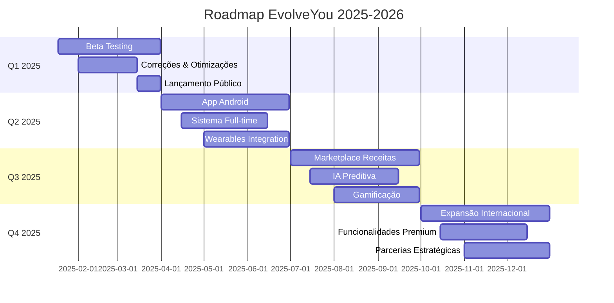

# 🛣️ Roadmap EvolveYou - 2025-2026

## 🎯 Visão Estratégica

O EvolveYou tem como missão revolucionar a nutrição no Brasil através da Inteligência Artificial, tornando-se a plataforma líder em coaching nutricional personalizado.

### Objetivos Estratégicos 2025-2026

1. **🇧🇷 Liderança Nacional**: Tornar-se a #1 em IA nutricional no Brasil
2. **📈 Crescimento Exponencial**: 100K+ usuários ativos até final de 2025
3. **🤖 Inovação Contínua**: Manter vantagem tecnológica de 6+ meses
4. **💰 Sustentabilidade**: Atingir break-even até Q3 2025
5. **🌎 Expansão Internacional**: Lançar em 3+ países até 2026

## 📅 Timeline Executivo



## 🚀 Q1 2025 - Consolidação e Lançamento

### 🎯 Objetivos do Trimestre
- Validar produto com usuários reais
- Corrigir bugs críticos e otimizar performance
- Lançar publicamente com marketing estruturado
- Atingir 1.000 usuários ativos

### 📋 Épicos e Features

#### 🧪 Beta Testing Program (Jan 18 - Mar 15)
**Objetivo**: Validar produto com 50 usuários selecionados

**Features**:
- [ ] **Sistema de Convites Beta**
  - Portal de inscrição para beta testers
  - Seleção criteriosa de perfis diversos
  - Onboarding especial para beta users
  - **Prazo**: Jan 25
  - **Responsável**: Frontend Team

- [ ] **Dashboard de Feedback**
  - Coleta estruturada de feedback
  - Analytics de uso em tempo real
  - Identificação de pain points
  - **Prazo**: Feb 01
  - **Responsável**: Backend Team

- [ ] **Sistema de Bug Tracking**
  - Integração com Sentry para erros
  - Hotjar para análise de comportamento
  - Feedback direto no app
  - **Prazo**: Feb 05
  - **Responsável**: DevOps Team

#### 🔧 Correções e Otimizações (Feb 01 - Mar 15)
**Objetivo**: Atingir 95% de satisfação dos beta users

**Features**:
- [ ] **Otimização de Performance**
  - Reduzir tempo de resposta para < 1s
  - Implementar cache inteligente
  - Otimizar queries do banco
  - **Prazo**: Feb 20
  - **Responsável**: Backend Team

- [ ] **Melhorias de UX**
  - Simplificar fluxo de anamnese
  - Melhorar onboarding
  - Adicionar tooltips e ajuda contextual
  - **Prazo**: Feb 25
  - **Responsável**: Frontend Team

- [ ] **Correções de Bugs**
  - Resolver 100% dos bugs críticos
  - Corrigir edge cases da anamnese
  - Melhorar tratamento de erros
  - **Prazo**: Mar 10
  - **Responsável**: All Teams

#### 🎉 Lançamento Público (Mar 15 - Mar 31)
**Objetivo**: Lançar com impacto e atingir 1K usuários

**Features**:
- [ ] **Campanha de Marketing**
  - Landing page otimizada para conversão
  - Conteúdo para redes sociais
  - Parcerias com influencers fitness
  - **Prazo**: Mar 15
  - **Responsável**: Marketing Team

- [ ] **Sistema de Referral**
  - Programa de indicação de amigos
  - Gamificação com recompensas
  - Tracking de conversões
  - **Prazo**: Mar 20
  - **Responsável**: Frontend Team

- [ ] **Suporte ao Cliente**
  - Chat de suporte integrado
  - FAQ completo
  - Tutoriais em vídeo
  - **Prazo**: Mar 25
  - **Responsável**: Support Team

### 📊 KPIs Q1 2025
- **Usuários Ativos**: 1.000
- **Taxa de Retenção**: > 60% (30 dias)
- **NPS**: > 50
- **Tempo de Resposta**: < 1s
- **Uptime**: > 99.9%
- **Bugs Críticos**: 0

## 🚀 Q2 2025 - Expansão Mobile e Automação

### 🎯 Objetivos do Trimestre
- Lançar aplicativo Android nativo
- Implementar sistema Full-time
- Integrar com wearables
- Atingir 10.000 usuários ativos

### 📋 Épicos e Features

#### 📱 Aplicativo Android (Abr 01 - Jun 30)
**Objetivo**: Paridade completa com iOS

**Features**:
- [ ] **App Android Nativo**
  - Kotlin + Jetpack Compose
  - Material Design 3
  - Sincronização em tempo real
  - **Prazo**: Jun 15
  - **Responsável**: Android Team

- [ ] **Notificações Push**
  - Lembretes de refeições
  - Dicas nutricionais personalizadas
  - Conquistas e milestones
  - **Prazo**: Mai 01
  - **Responsável**: Mobile Team

- [ ] **Modo Offline**
  - Cache de dados essenciais
  - Sincronização automática
  - Funcionalidades básicas offline
  - **Prazo**: Jun 01
  - **Responsável**: Mobile Team

#### 🔄 Sistema Full-time (Abr 15 - Jun 15)
**Objetivo**: Rebalanceamento automático de macros

**Features**:
- [ ] **Engine de Rebalanceamento**
  - Algoritmos de ajuste dinâmico
  - Machine Learning para padrões
  - Validação nutricional automática
  - **Prazo**: Mai 15
  - **Responsável**: AI Team

- [ ] **Dashboard de Progresso**
  - Visualização de tendências
  - Alertas de desvios
  - Sugestões proativas
  - **Prazo**: Jun 01
  - **Responsável**: Frontend Team

- [ ] **Integração Coach EVO**
  - Recomendações baseadas em dados
  - Explicações dos ajustes
  - Coaching proativo
  - **Prazo**: Jun 10
  - **Responsável**: AI Team

#### ⌚ Integração Wearables (Mai 01 - Jun 30)
**Objetivo**: Dados automáticos de atividade

**Features**:
- [ ] **Apple Health Integration**
  - Sincronização de atividades
  - Dados de sono e estresse
  - Calorias queimadas
  - **Prazo**: Mai 30
  - **Responsável**: iOS Team

- [ ] **Google Fit Integration**
  - Dados de exercícios
  - Passos e distância
  - Frequência cardíaca
  - **Prazo**: Jun 15
  - **Responsável**: Android Team

- [ ] **Fitbit & Garmin APIs**
  - Integração com dispositivos populares
  - Dados de treino detalhados
  - Métricas de recuperação
  - **Prazo**: Jun 30
  - **Responsável**: Backend Team

### 📊 KPIs Q2 2025
- **Usuários Ativos**: 10.000
- **Downloads Mobile**: 5.000
- **Engajamento**: > 70% uso semanal
- **Precisão IA**: > 90%
- **Integrações Ativas**: > 30%

## 🚀 Q3 2025 - Inovação e Gamificação

### 🎯 Objetivos do Trimestre
- Lançar marketplace de receitas
- Implementar IA preditiva
- Sistema de gamificação completo
- Atingir 50.000 usuários ativos

### 📋 Épicos e Features

#### 🍽️ Marketplace de Receitas (Jul 01 - Set 30)
**Objetivo**: Comunidade de receitas saudáveis

**Features**:
- [ ] **Plataforma de Receitas**
  - Upload e compartilhamento
  - Avaliações e comentários
  - Busca inteligente por ingredientes
  - **Prazo**: Ago 15
  - **Responsável**: Frontend Team

- [ ] **Sistema de Monetização**
  - Receitas premium
  - Chefs parceiros
  - Comissões por vendas
  - **Prazo**: Set 01
  - **Responsável**: Business Team

- [ ] **IA para Receitas**
  - Geração automática de receitas
  - Adaptação para restrições
  - Otimização nutricional
  - **Prazo**: Set 15
  - **Responsável**: AI Team

#### 🔮 IA Preditiva (Jul 15 - Set 15)
**Objetivo**: Antecipar necessidades do usuário

**Features**:
- [ ] **Predição de Comportamento**
  - Análise de padrões alimentares
  - Previsão de desvios
  - Intervenções preventivas
  - **Prazo**: Ago 30
  - **Responsável**: AI Team

- [ ] **Recomendações Proativas**
  - Sugestões antes das refeições
  - Alertas de hidratação
  - Lembretes personalizados
  - **Prazo**: Set 10
  - **Responsável**: AI Team

- [ ] **Análise de Tendências**
  - Identificação de padrões sazonais
  - Adaptação a mudanças de rotina
  - Otimização contínua
  - **Prazo**: Set 15
  - **Responsável**: Data Team

#### 🎮 Sistema de Gamificação (Ago 01 - Set 30)
**Objetivo**: Aumentar engajamento e retenção

**Features**:
- [ ] **Sistema de Pontos**
  - Pontos por ações saudáveis
  - Multiplicadores e bônus
  - Ranking entre amigos
  - **Prazo**: Ago 20
  - **Responsável**: Frontend Team

- [ ] **Conquistas e Badges**
  - Milestones nutricionais
  - Desafios semanais
  - Conquistas sociais
  - **Prazo**: Set 05
  - **Responsável**: Frontend Team

- [ ] **Desafios Comunitários**
  - Competições entre usuários
  - Desafios sazonais
  - Prêmios e recompensas
  - **Prazo**: Set 25
  - **Responsável**: Community Team

### 📊 KPIs Q3 2025
- **Usuários Ativos**: 50.000
- **Receitas Compartilhadas**: 1.000
- **Engajamento Gamificação**: > 80%
- **Receita Marketplace**: R$ 50K
- **Retenção 90 dias**: > 40%

## 🚀 Q4 2025 - Expansão e Premium

### 🎯 Objetivos do Trimestre
- Expansão internacional (3 países)
- Funcionalidades premium
- Parcerias estratégicas
- Atingir 100.000 usuários ativos

### 📋 Épicos e Features

#### 🌎 Expansão Internacional (Out 01 - Dez 31)
**Objetivo**: Lançar em Argentina, México e Portugal

**Features**:
- [ ] **Localização Completa**
  - Tradução para espanhol e português PT
  - Adaptação cultural de conteúdo
  - Bases de dados locais de alimentos
  - **Prazo**: Nov 15
  - **Responsável**: Localization Team

- [ ] **Parcerias Locais**
  - Nutricionistas e influencers
  - Distribuidores de alimentos
  - Academias e clínicas
  - **Prazo**: Dez 01
  - **Responsável**: Business Team

- [ ] **Marketing Internacional**
  - Campanhas localizadas
  - SEO em múltiplos idiomas
  - Estratégias por país
  - **Prazo**: Dez 15
  - **Responsável**: Marketing Team

#### ⭐ Funcionalidades Premium (Out 15 - Dez 15)
**Objetivo**: Monetização através de assinatura

**Features**:
- [ ] **Planos de Assinatura**
  - Freemium com limitações
  - Premium com funcionalidades avançadas
  - Pro para profissionais
  - **Prazo**: Nov 01
  - **Responsável**: Business Team

- [ ] **Features Premium**
  - Análises avançadas de progresso
  - Consultas ilimitadas com Coach EVO
  - Planos de refeição personalizados
  - **Prazo**: Nov 30
  - **Responsável**: All Teams

- [ ] **Dashboard Profissional**
  - Ferramentas para nutricionistas
  - Gestão de múltiplos pacientes
  - Relatórios detalhados
  - **Prazo**: Dez 10
  - **Responsável**: Frontend Team

#### 🤝 Parcerias Estratégicas (Nov 01 - Dez 31)
**Objetivo**: Acelerar crescimento através de parcerias

**Features**:
- [ ] **Integração com Academias**
  - API para sistemas de academia
  - Planos corporativos
  - Dashboards para personal trainers
  - **Prazo**: Nov 30
  - **Responsável**: Business Team

- [ ] **Parcerias com Supermercados**
  - Lista de compras integrada
  - Delivery de ingredientes
  - Descontos para usuários
  - **Prazo**: Dez 15
  - **Responsável**: Business Team

- [ ] **Colaboração com Clínicas**
  - Integração com prontuários
  - Relatórios para médicos
  - Programas de prevenção
  - **Prazo**: Dez 30
  - **Responsável**: Healthcare Team

### 📊 KPIs Q4 2025
- **Usuários Ativos**: 100.000
- **Usuários Internacionais**: 20.000
- **Assinantes Premium**: 5.000
- **Receita Mensal**: R$ 500K
- **Parcerias Ativas**: 50

## 🔮 Visão 2026 - Liderança e Inovação

### 🎯 Objetivos Estratégicos 2026

#### 🏆 Liderança de Mercado
- **#1 em IA Nutricional** no Brasil e América Latina
- **500K+ usuários ativos** em 5+ países
- **R$ 10M+ ARR** (Annual Recurring Revenue)
- **50+ parcerias estratégicas** ativas

#### 🚀 Inovações Tecnológicas

##### 🧬 IA de Próxima Geração
- **Análise Genética**: Recomendações baseadas em DNA
- **Biomarkers**: Integração com exames laboratoriais
- **Microbioma**: Análise da flora intestinal
- **Metabolômica**: Perfil metabólico personalizado

##### 🔬 Pesquisa e Desenvolvimento
- **Laboratório de IA**: Centro de pesquisa próprio
- **Publicações Científicas**: Papers em journals internacionais
- **Patentes**: Proteção de propriedade intelectual
- **Colaborações Acadêmicas**: Parcerias com universidades

##### 🌐 Plataforma Ecossistêmica
- **API Pública**: Marketplace de desenvolvedores
- **SDK para Terceiros**: Integração facilitada
- **White Label**: Soluções para empresas
- **B2B2C**: Parcerias com grandes corporações

#### 📈 Expansão Global

##### 🌍 Novos Mercados
- **Estados Unidos**: Mercado premium
- **Europa**: Foco em sustentabilidade
- **Ásia**: Adaptação cultural profunda
- **África**: Soluções para desnutrição

##### 🏢 Modelo de Negócio Diversificado
- **SaaS B2B**: Soluções empresariais
- **Marketplace**: Comissões e taxas
- **Consultoria**: Serviços especializados
- **Licenciamento**: Tecnologia para terceiros

### 📅 Roadmap Detalhado 2026

#### Q1 2026 - Consolidação Internacional
- Otimização de operações internacionais
- Expansão para Estados Unidos
- Lançamento de API pública
- Centro de pesquisa em IA

#### Q2 2026 - Inovação Científica
- Integração com análise genética
- Parcerias com laboratórios
- Publicação de pesquisas
- Patentes de tecnologia

#### Q3 2026 - Ecossistema B2B
- Plataforma white label
- Soluções corporativas
- Marketplace de desenvolvedores
- Programa de certificação

#### Q4 2026 - Sustentabilidade e Impacto
- Iniciativas de sustentabilidade
- Programas sociais
- Impacto em saúde pública
- Preparação para IPO

## 📊 Métricas de Sucesso 2025-2026

### 📈 Crescimento de Usuários
```
2025 Q1: 1K usuários
2025 Q2: 10K usuários  
2025 Q3: 50K usuários
2025 Q4: 100K usuários
2026 Q4: 500K usuários
```

### 💰 Receita Projetada
```
2025 Q1: R$ 0 (beta gratuito)
2025 Q2: R$ 50K/mês
2025 Q3: R$ 200K/mês  
2025 Q4: R$ 500K/mês
2026 Q4: R$ 2M/mês
```

### 🌍 Expansão Geográfica
```
2025 Q1: Brasil
2025 Q4: Brasil + 3 países
2026 Q2: 7 países
2026 Q4: 15 países
```

### 🤖 Evolução Tecnológica
```
2025: IA conversacional + análise de imagens
2026: IA preditiva + análise genética + biomarkers
```

## 🎯 Fatores Críticos de Sucesso

### 🔑 Tecnologia
- **Vantagem Competitiva**: Manter 6+ meses à frente
- **Escalabilidade**: Suportar crescimento exponencial
- **Qualidade**: 99.9% uptime e < 1s resposta
- **Inovação**: Lançar 1 feature disruptiva por trimestre

### 👥 Equipe
- **Talentos**: Atrair os melhores profissionais
- **Cultura**: Manter cultura de inovação e excelência
- **Crescimento**: Escalar equipe de 10 para 100+ pessoas
- **Retenção**: > 90% retenção de talentos chave

### 💼 Negócio
- **Product-Market Fit**: Validar em cada novo mercado
- **Monetização**: Diversificar fontes de receita
- **Parcerias**: Acelerar crescimento através de alianças
- **Funding**: Garantir capital para expansão agressiva

### 🏥 Impacto Social
- **Saúde Pública**: Melhorar nutrição de milhões
- **Acessibilidade**: Democratizar coaching nutricional
- **Sustentabilidade**: Promover alimentação sustentável
- **Educação**: Elevar consciência nutricional

## 🚨 Riscos e Mitigações

### ⚠️ Riscos Tecnológicos
- **Concorrência**: Grandes techs entrarem no mercado
- **Mitigação**: Manter vantagem através de inovação constante

- **Escalabilidade**: Problemas de performance com crescimento
- **Mitigação**: Arquitetura cloud-native e monitoramento proativo

### ⚠️ Riscos de Mercado
- **Regulamentação**: Mudanças em leis de saúde digital
- **Mitigação**: Compliance proativo e relacionamento regulatório

- **Economia**: Recessão afetando poder de compra
- **Mitigação**: Modelo freemium e foco em valor demonstrável

### ⚠️ Riscos Operacionais
- **Talentos**: Dificuldade em contratar especialistas
- **Mitigação**: Marca empregadora forte e equity atrativo

- **Funding**: Dificuldade em levantar capital
- **Mitigação**: Métricas sólidas e diversificação de investidores

## 🎉 Conclusão

O roadmap 2025-2026 do EvolveYou é ambicioso mas realizável, baseado em:

### ✅ Fundações Sólidas
- Tecnologia de ponta já implementada
- Equipe experiente e motivada
- Produto validado e diferenciado
- Infraestrutura escalável

### 🚀 Visão Clara
- Liderança em IA nutricional
- Expansão internacional estruturada
- Inovação científica contínua
- Impacto social positivo

### 📈 Execução Disciplinada
- Métricas claras de sucesso
- Milestones bem definidos
- Riscos identificados e mitigados
- Flexibilidade para adaptações

**O EvolveYou está posicionado para revolucionar a nutrição global através da IA, começando pelo Brasil e expandindo para o mundo.**

---

**Última atualização**: 18/01/2025  
**Versão**: 1.0  
**Próxima revisão**: 18/04/2025

