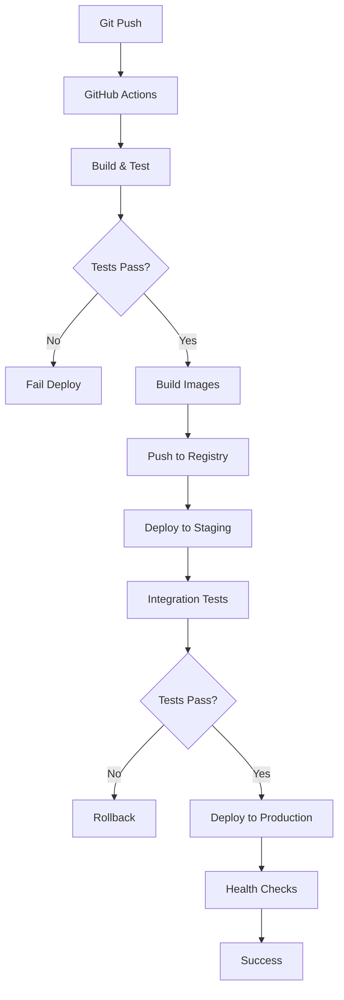

# 🚀 Guia de Deploy - EvolveYou

## 📋 Visão Geral

Este guia cobre todos os aspectos de deploy do EvolveYou, desde desenvolvimento local até produção em escala.

### Ambientes

- **Development**: Ambiente local de desenvolvimento
- **Staging**: Ambiente de testes e homologação
- **Production**: Ambiente de produção

## 🏗️ Arquitetura de Deploy

### Infraestrutura

```
Google Cloud Platform
├── 🌐 Cloud Run (Backend Services)
├── 🔥 Firebase Hosting (Frontend)
├── 🗄️ Firestore (Database)
├── 📦 Cloud Storage (Assets)
├── 🤖 Vertex AI (Coach EVO)
├── 🔍 Cloud Monitoring (Observability)
└── 🔒 Cloud IAM (Security)
```

### Fluxo de Deploy



## 🔧 Configuração Inicial

### 1. Google Cloud Setup

#### Criar Projeto
```bash
# Instalar gcloud CLI
curl https://sdk.cloud.google.com | bash
exec -l $SHELL

# Autenticar
gcloud auth login

# Criar projeto
gcloud projects create evolveyou-prod --name="EvolveYou Production"
gcloud config set project evolveyou-prod

# Ativar APIs necessárias
gcloud services enable \
  cloudbuild.googleapis.com \
  run.googleapis.com \
  firestore.googleapis.com \
  storage.googleapis.com \
  aiplatform.googleapis.com \
  monitoring.googleapis.com
```

#### Configurar IAM
```bash
# Criar service account para deploy
gcloud iam service-accounts create evolveyou-deploy \
  --display-name="EvolveYou Deploy Service Account"

# Adicionar roles necessárias
gcloud projects add-iam-policy-binding evolveyou-prod \
  --member="serviceAccount:evolveyou-deploy@evolveyou-prod.iam.gserviceaccount.com" \
  --role="roles/run.admin"

gcloud projects add-iam-policy-binding evolveyou-prod \
  --member="serviceAccount:evolveyou-deploy@evolveyou-prod.iam.gserviceaccount.com" \
  --role="roles/storage.admin"

# Gerar chave para GitHub Actions
gcloud iam service-accounts keys create deploy-key.json \
  --iam-account=evolveyou-deploy@evolveyou-prod.iam.gserviceaccount.com
```

### 2. Firebase Setup

#### Configurar Firebase
```bash
# Instalar Firebase CLI
npm install -g firebase-tools

# Autenticar
firebase login

# Inicializar projeto
firebase init

# Configurar Firestore
firebase firestore:rules:set firestore.rules
firebase firestore:indexes:set firestore.indexes.json

# Configurar Storage
firebase storage:rules:set storage.rules

# Configurar Hosting
firebase hosting:channel:create staging
```

#### Configurar Authentication
```bash
# Ativar providers
firebase auth:providers:enable password
firebase auth:providers:enable google.com

# Configurar domínios autorizados
firebase auth:domains:add evolveyou.com.br
firebase auth:domains:add staging.evolveyou.com.br
```

### 3. GitHub Secrets

Configure os seguintes secrets no GitHub:

```bash
# Google Cloud
GOOGLE_CLOUD_PROJECT=evolveyou-prod
GOOGLE_CLOUD_SA_KEY=<conteúdo do deploy-key.json>

# Firebase
FIREBASE_PROJECT_ID=evolveyou-prod
FIREBASE_TOKEN=<token do firebase login:ci>

# Environment Variables
DATABASE_URL=<firestore-url>
VERTEX_AI_LOCATION=us-central1
```

## 🐳 Containerização

### Backend Services

#### Users Service Dockerfile
```dockerfile
FROM python:3.11-slim

WORKDIR /app

# Install system dependencies
RUN apt-get update && apt-get install -y \
    gcc \
    && rm -rf /var/lib/apt/lists/*

# Copy requirements and install Python dependencies
COPY requirements.txt .
RUN pip install --no-cache-dir -r requirements.txt

# Copy source code
COPY . .

# Create non-root user
RUN useradd --create-home --shell /bin/bash evolveyou
RUN chown -R evolveyou:evolveyou /app
USER evolveyou

# Health check
HEALTHCHECK --interval=30s --timeout=30s --start-period=5s --retries=3 \
    CMD curl -f http://localhost:8001/health || exit 1

# Run the application
CMD ["python", "-m", "uvicorn", "src.main:app", "--host", "0.0.0.0", "--port", "8001"]
```

#### Coach EVO Service Dockerfile
```dockerfile
FROM python:3.11-slim

WORKDIR /app

# Install system dependencies
RUN apt-get update && apt-get install -y \
    gcc \
    curl \
    && rm -rf /var/lib/apt/lists/*

# Copy requirements and install Python dependencies
COPY requirements.txt .
RUN pip install --no-cache-dir -r requirements.txt

# Copy source code
COPY . .

# Create non-root user
RUN useradd --create-home --shell /bin/bash evolveyou
RUN chown -R evolveyou:evolveyou /app
USER evolveyou

# Health check
HEALTHCHECK --interval=30s --timeout=30s --start-period=5s --retries=3 \
    CMD curl -f http://localhost:8004/health || exit 1

# Run the application
CMD ["python", "-m", "uvicorn", "src.main:app", "--host", "0.0.0.0", "--port", "8004"]
```

### Frontend Applications

#### Web App Dockerfile
```dockerfile
# Build stage
FROM node:18-alpine AS builder

WORKDIR /app

# Copy package files
COPY package*.json ./
RUN npm ci --only=production

# Copy source and build
COPY . .
RUN npm run build

# Production stage
FROM nginx:alpine

# Copy built assets
COPY --from=builder /app/dist /usr/share/nginx/html

# Copy nginx configuration
COPY nginx.conf /etc/nginx/nginx.conf

# Health check
HEALTHCHECK --interval=30s --timeout=3s --start-period=5s --retries=3 \
    CMD curl -f http://localhost/ || exit 1

EXPOSE 80
CMD ["nginx", "-g", "daemon off;"]
```

## 🔄 CI/CD Pipeline

### GitHub Actions Workflow

#### Backend Deploy
```yaml
# .github/workflows/backend-deploy.yml
name: Backend Deploy

on:
  push:
    branches: [main]
    paths: ['backend/**']
  pull_request:
    branches: [main]
    paths: ['backend/**']

env:
  GOOGLE_CLOUD_PROJECT: ${{ secrets.GOOGLE_CLOUD_PROJECT }}
  GOOGLE_CLOUD_SA_KEY: ${{ secrets.GOOGLE_CLOUD_SA_KEY }}

jobs:
  test:
    runs-on: ubuntu-latest
    
    steps:
    - uses: actions/checkout@v3
    
    - name: Set up Python
      uses: actions/setup-python@v4
      with:
        python-version: '3.11'
    
    - name: Install dependencies
      run: |
        cd backend/services/users-service
        pip install -r requirements.txt
    
    - name: Run tests
      run: |
        cd backend/services/users-service
        python -m pytest tests/ -v --cov=src --cov-report=xml
    
    - name: Upload coverage
      uses: codecov/codecov-action@v3
      with:
        file: ./backend/services/users-service/coverage.xml

  deploy:
    needs: test
    runs-on: ubuntu-latest
    if: github.ref == 'refs/heads/main'
    
    steps:
    - uses: actions/checkout@v3
    
    - name: Setup Google Cloud
      uses: google-github-actions/setup-gcloud@v1
      with:
        service_account_key: ${{ secrets.GOOGLE_CLOUD_SA_KEY }}
        project_id: ${{ secrets.GOOGLE_CLOUD_PROJECT }}
    
    - name: Configure Docker
      run: gcloud auth configure-docker
    
    - name: Build and push Users Service
      run: |
        cd backend/services/users-service
        docker build -t gcr.io/$GOOGLE_CLOUD_PROJECT/users-service:$GITHUB_SHA .
        docker push gcr.io/$GOOGLE_CLOUD_PROJECT/users-service:$GITHUB_SHA
    
    - name: Deploy to Cloud Run
      run: |
        gcloud run deploy users-service \
          --image gcr.io/$GOOGLE_CLOUD_PROJECT/users-service:$GITHUB_SHA \
          --platform managed \
          --region us-central1 \
          --allow-unauthenticated \
          --set-env-vars="ENVIRONMENT=production,FIREBASE_PROJECT_ID=$GOOGLE_CLOUD_PROJECT"
    
    - name: Build and push Coach EVO Service
      run: |
        cd backend/services/coach-evo-service
        docker build -t gcr.io/$GOOGLE_CLOUD_PROJECT/coach-evo-service:$GITHUB_SHA .
        docker push gcr.io/$GOOGLE_CLOUD_PROJECT/coach-evo-service:$GITHUB_SHA
    
    - name: Deploy Coach EVO to Cloud Run
      run: |
        gcloud run deploy coach-evo-service \
          --image gcr.io/$GOOGLE_CLOUD_PROJECT/coach-evo-service:$GITHUB_SHA \
          --platform managed \
          --region us-central1 \
          --allow-unauthenticated \
          --set-env-vars="ENVIRONMENT=production,GOOGLE_CLOUD_PROJECT=$GOOGLE_CLOUD_PROJECT"
```

#### Frontend Deploy
```yaml
# .github/workflows/frontend-deploy.yml
name: Frontend Deploy

on:
  push:
    branches: [main]
    paths: ['frontend/**']
  pull_request:
    branches: [main]
    paths: ['frontend/**']

env:
  FIREBASE_PROJECT_ID: ${{ secrets.FIREBASE_PROJECT_ID }}
  FIREBASE_TOKEN: ${{ secrets.FIREBASE_TOKEN }}

jobs:
  test:
    runs-on: ubuntu-latest
    
    steps:
    - uses: actions/checkout@v3
    
    - name: Setup Node.js
      uses: actions/setup-node@v3
      with:
        node-version: '18'
        cache: 'npm'
    
    - name: Install dependencies
      run: |
        cd frontend/web-app
        npm ci
    
    - name: Run tests
      run: |
        cd frontend/web-app
        npm test -- --coverage --watchAll=false
    
    - name: Run linting
      run: |
        cd frontend/web-app
        npm run lint

  build-and-deploy:
    needs: test
    runs-on: ubuntu-latest
    if: github.ref == 'refs/heads/main'
    
    steps:
    - uses: actions/checkout@v3
    
    - name: Setup Node.js
      uses: actions/setup-node@v3
      with:
        node-version: '18'
        cache: 'npm'
    
    - name: Install dependencies
      run: |
        cd frontend/web-app
        npm ci
    
    - name: Build application
      run: |
        cd frontend/web-app
        npm run build
      env:
        REACT_APP_API_URL: https://users-service-hash-uc.a.run.app
        REACT_APP_COACH_URL: https://coach-evo-service-hash-uc.a.run.app
        REACT_APP_FIREBASE_CONFIG: ${{ secrets.FIREBASE_CONFIG }}
    
    - name: Deploy to Firebase Hosting
      run: |
        cd frontend/web-app
        npx firebase deploy --only hosting --token $FIREBASE_TOKEN
```

## 🌐 Configuração de Domínio

### DNS Configuration

#### Cloudflare Setup
```bash
# A records
evolveyou.com.br -> Firebase Hosting IP
api.evolveyou.com.br -> Cloud Run Users Service
coach.evolveyou.com.br -> Cloud Run Coach EVO Service

# CNAME records
www.evolveyou.com.br -> evolveyou.com.br
staging.evolveyou.com.br -> Firebase Hosting
```

#### SSL Certificates
```bash
# Firebase Hosting (automático)
firebase hosting:sites:create evolveyou-prod

# Cloud Run (automático com domínio customizado)
gcloud run domain-mappings create \
  --service users-service \
  --domain api.evolveyou.com.br \
  --region us-central1
```

## 📊 Monitoramento e Observabilidade

### Google Cloud Monitoring

#### Alertas
```yaml
# monitoring/alerts.yml
alertPolicy:
  displayName: "EvolveYou High Error Rate"
  conditions:
    - displayName: "Error rate > 5%"
      conditionThreshold:
        filter: 'resource.type="cloud_run_revision"'
        comparison: COMPARISON_GREATER_THAN
        thresholdValue: 0.05
  notificationChannels:
    - projects/evolveyou-prod/notificationChannels/slack-alerts
```

#### Dashboards
```json
{
  "displayName": "EvolveYou Production Dashboard",
  "mosaicLayout": {
    "tiles": [
      {
        "width": 6,
        "height": 4,
        "widget": {
          "title": "Request Rate",
          "xyChart": {
            "dataSets": [{
              "timeSeriesQuery": {
                "timeSeriesFilter": {
                  "filter": "resource.type=\"cloud_run_revision\"",
                  "aggregation": {
                    "alignmentPeriod": "60s",
                    "perSeriesAligner": "ALIGN_RATE"
                  }
                }
              }
            }]
          }
        }
      }
    ]
  }
}
```

### Application Monitoring

#### Health Checks
```python
# Backend health check
@app.get("/health")
async def health_check():
    try:
        # Check database connection
        await firestore_client.collection("health").limit(1).get()
        
        # Check external services
        vertex_ai_status = await check_vertex_ai()
        
        return {
            "status": "healthy",
            "timestamp": datetime.utcnow().isoformat(),
            "services": {
                "database": "connected",
                "vertex_ai": vertex_ai_status,
                "version": "1.0.0"
            }
        }
    except Exception as e:
        raise HTTPException(status_code=503, detail=f"Service unhealthy: {str(e)}")
```

#### Metrics Collection
```python
# Prometheus metrics
from prometheus_client import Counter, Histogram, generate_latest

REQUEST_COUNT = Counter('http_requests_total', 'Total HTTP requests', ['method', 'endpoint'])
REQUEST_DURATION = Histogram('http_request_duration_seconds', 'HTTP request duration')

@app.middleware("http")
async def metrics_middleware(request: Request, call_next):
    start_time = time.time()
    
    response = await call_next(request)
    
    REQUEST_COUNT.labels(method=request.method, endpoint=request.url.path).inc()
    REQUEST_DURATION.observe(time.time() - start_time)
    
    return response

@app.get("/metrics")
async def metrics():
    return Response(generate_latest(), media_type="text/plain")
```

## 🔒 Segurança

### Configuração de Segurança

#### Cloud Run Security
```bash
# Deploy com configurações de segurança
gcloud run deploy users-service \
  --image gcr.io/evolveyou-prod/users-service:latest \
  --no-allow-unauthenticated \
  --service-account=users-service@evolveyou-prod.iam.gserviceaccount.com \
  --set-env-vars="ENVIRONMENT=production" \
  --cpu-limit=2 \
  --memory=2Gi \
  --max-instances=100 \
  --concurrency=80
```

#### Firebase Security Rules
```javascript
// firestore.rules
rules_version = '2';
service cloud.firestore {
  match /databases/{database}/documents {
    // Users can only access their own data
    match /users/{userId} {
      allow read, write: if request.auth != null && request.auth.uid == userId;
    }
    
    // Anamnese data
    match /anamnese/{anamneseId} {
      allow read, write: if request.auth != null && 
        resource.data.userId == request.auth.uid;
    }
    
    // TACO data is read-only for authenticated users
    match /taco/{document=**} {
      allow read: if request.auth != null;
    }
  }
}
```

#### Storage Security Rules
```javascript
// storage.rules
rules_version = '2';
service firebase.storage {
  match /b/{bucket}/o {
    // User profile images
    match /users/{userId}/profile/{allPaths=**} {
      allow read, write: if request.auth != null && request.auth.uid == userId;
    }
    
    // Meal images
    match /meals/{userId}/{allPaths=**} {
      allow read, write: if request.auth != null && request.auth.uid == userId;
    }
  }
}
```

### Secrets Management

#### Google Secret Manager
```bash
# Criar secrets
gcloud secrets create database-url --data-file=database-url.txt
gcloud secrets create api-keys --data-file=api-keys.json

# Dar acesso aos serviços
gcloud secrets add-iam-policy-binding database-url \
  --member="serviceAccount:users-service@evolveyou-prod.iam.gserviceaccount.com" \
  --role="roles/secretmanager.secretAccessor"
```

#### Uso nos serviços
```python
# Acessar secrets
from google.cloud import secretmanager

def get_secret(secret_id: str) -> str:
    client = secretmanager.SecretManagerServiceClient()
    name = f"projects/evolveyou-prod/secrets/{secret_id}/versions/latest"
    response = client.access_secret_version(request={"name": name})
    return response.payload.data.decode("UTF-8")

# Usar no código
DATABASE_URL = get_secret("database-url")
```

## 🔄 Estratégias de Deploy

### Blue-Green Deployment

```bash
# Deploy para ambiente green
gcloud run deploy users-service-green \
  --image gcr.io/evolveyou-prod/users-service:$NEW_VERSION \
  --no-traffic

# Testar ambiente green
curl https://users-service-green-hash-uc.a.run.app/health

# Migrar tráfego gradualmente
gcloud run services update-traffic users-service \
  --to-revisions=users-service-green=10

# Se tudo OK, migrar 100%
gcloud run services update-traffic users-service \
  --to-revisions=users-service-green=100

# Remover versão antiga
gcloud run revisions delete users-service-blue
```

### Canary Deployment

```bash
# Deploy nova versão com 0% de tráfego
gcloud run deploy users-service \
  --image gcr.io/evolveyou-prod/users-service:$NEW_VERSION \
  --no-traffic

# Direcionar 5% do tráfego para nova versão
gcloud run services update-traffic users-service \
  --to-revisions=users-service-$NEW_VERSION=5,users-service-$OLD_VERSION=95

# Monitorar métricas e aumentar gradualmente
gcloud run services update-traffic users-service \
  --to-revisions=users-service-$NEW_VERSION=50,users-service-$OLD_VERSION=50

# Se métricas OK, migrar 100%
gcloud run services update-traffic users-service \
  --to-revisions=users-service-$NEW_VERSION=100
```

### Rollback Strategy

```bash
# Rollback automático em caso de falha
#!/bin/bash
NEW_REVISION=$1
OLD_REVISION=$2

# Deploy nova versão
gcloud run deploy users-service --image $NEW_REVISION --no-traffic

# Testar health check
if ! curl -f https://users-service-hash-uc.a.run.app/health; then
  echo "Health check failed, rolling back"
  gcloud run services update-traffic users-service --to-revisions=$OLD_REVISION=100
  exit 1
fi

# Migrar tráfego gradualmente com verificações
for traffic in 10 25 50 100; do
  gcloud run services update-traffic users-service \
    --to-revisions=$NEW_REVISION=$traffic,$OLD_REVISION=$((100-traffic))
  
  sleep 60
  
  # Verificar métricas de erro
  ERROR_RATE=$(gcloud monitoring metrics list --filter="metric.type=run.googleapis.com/request_count" --format="value(points[0].value.int64Value)")
  
  if [ $ERROR_RATE -gt 5 ]; then
    echo "Error rate too high, rolling back"
    gcloud run services update-traffic users-service --to-revisions=$OLD_REVISION=100
    exit 1
  fi
done

echo "Deploy successful"
```

## 📈 Scaling e Performance

### Auto Scaling Configuration

```bash
# Configurar auto scaling
gcloud run services update users-service \
  --min-instances=2 \
  --max-instances=100 \
  --concurrency=80 \
  --cpu=2 \
  --memory=2Gi
```

### Performance Optimization

#### Backend Optimization
```python
# Configuração de performance
import asyncio
from fastapi import FastAPI
from fastapi.middleware.gzip import GZipMiddleware
from fastapi.middleware.cors import CORSMiddleware

app = FastAPI()

# Middleware de compressão
app.add_middleware(GZipMiddleware, minimum_size=1000)

# Connection pooling
from google.cloud.firestore import Client
firestore_client = Client()

# Cache com Redis
import redis
redis_client = redis.Redis(host='redis-host', port=6379, db=0)

@app.middleware("http")
async def cache_middleware(request: Request, call_next):
    # Implementar cache de responses
    cache_key = f"cache:{request.url}"
    cached_response = redis_client.get(cache_key)
    
    if cached_response:
        return Response(cached_response, media_type="application/json")
    
    response = await call_next(request)
    
    if response.status_code == 200:
        redis_client.setex(cache_key, 300, response.body)  # Cache por 5 minutos
    
    return response
```

#### Frontend Optimization
```javascript
// Lazy loading de componentes
const Dashboard = lazy(() => import('./components/Dashboard'));
const Profile = lazy(() => import('./components/Profile'));

// Code splitting por rota
const App = () => (
  <Router>
    <Suspense fallback={<Loading />}>
      <Routes>
        <Route path="/dashboard" element={<Dashboard />} />
        <Route path="/profile" element={<Profile />} />
      </Routes>
    </Suspense>
  </Router>
);

// Service Worker para cache
// public/sw.js
const CACHE_NAME = 'evolveyou-v1';
const urlsToCache = [
  '/',
  '/static/js/bundle.js',
  '/static/css/main.css'
];

self.addEventListener('install', (event) => {
  event.waitUntil(
    caches.open(CACHE_NAME)
      .then((cache) => cache.addAll(urlsToCache))
  );
});
```

## 🧪 Testes de Deploy

### Smoke Tests

```bash
#!/bin/bash
# smoke-tests.sh

BASE_URL="https://api.evolveyou.com.br"

# Test health endpoints
echo "Testing health endpoints..."
curl -f $BASE_URL/health || exit 1
curl -f https://coach.evolveyou.com.br/health || exit 1

# Test authentication
echo "Testing authentication..."
TOKEN=$(curl -s -X POST $BASE_URL/auth/login \
  -H "Content-Type: application/json" \
  -d '{"email":"test@example.com","password":"test123"}' | jq -r '.token')

if [ "$TOKEN" = "null" ]; then
  echo "Authentication failed"
  exit 1
fi

# Test protected endpoints
echo "Testing protected endpoints..."
curl -f -H "Authorization: Bearer $TOKEN" $BASE_URL/users/profile || exit 1

echo "All smoke tests passed!"
```

### Integration Tests

```python
# tests/integration/test_deploy.py
import pytest
import requests
import os

BASE_URL = os.getenv('BASE_URL', 'https://api.evolveyou.com.br')

class TestDeployment:
    def test_health_endpoints(self):
        """Test all health endpoints are responding"""
        endpoints = [
            f"{BASE_URL}/health",
            "https://coach.evolveyou.com.br/health"
        ]
        
        for endpoint in endpoints:
            response = requests.get(endpoint)
            assert response.status_code == 200
            assert response.json()['status'] == 'healthy'
    
    def test_authentication_flow(self):
        """Test complete authentication flow"""
        # Register new user
        register_data = {
            "email": "test@example.com",
            "password": "test123",
            "name": "Test User"
        }
        
        response = requests.post(f"{BASE_URL}/auth/register", json=register_data)
        assert response.status_code in [201, 409]  # Created or already exists
        
        # Login
        login_data = {
            "email": "test@example.com",
            "password": "test123"
        }
        
        response = requests.post(f"{BASE_URL}/auth/login", json=login_data)
        assert response.status_code == 200
        
        token = response.json()['token']
        assert token is not None
        
        # Access protected resource
        headers = {"Authorization": f"Bearer {token}"}
        response = requests.get(f"{BASE_URL}/users/profile", headers=headers)
        assert response.status_code == 200
    
    def test_coach_evo_integration(self):
        """Test Coach EVO service integration"""
        # Get auth token first
        login_data = {"email": "test@example.com", "password": "test123"}
        auth_response = requests.post(f"{BASE_URL}/auth/login", json=login_data)
        token = auth_response.json()['token']
        headers = {"Authorization": f"Bearer {token}"}
        
        # Start conversation
        start_data = {
            "user_context": {
                "name": "Test User",
                "goals": ["weight_loss"]
            }
        }
        
        response = requests.post(
            "https://coach.evolveyou.com.br/api/v1/chat/start",
            json=start_data,
            headers=headers
        )
        
        assert response.status_code == 200
        assert 'conversation_id' in response.json()
```

## 🚨 Troubleshooting

### Problemas Comuns

#### 1. Deploy Falha
```bash
# Verificar logs
gcloud run services logs read users-service --limit=50

# Verificar configuração
gcloud run services describe users-service

# Verificar imagem
gcloud container images list --repository=gcr.io/evolveyou-prod
```

#### 2. Problemas de Conectividade
```bash
# Testar conectividade
gcloud run services proxy users-service --port=8080

# Verificar VPC connector
gcloud compute networks vpc-access connectors list

# Verificar firewall rules
gcloud compute firewall-rules list
```

#### 3. Problemas de Performance
```bash
# Verificar métricas
gcloud monitoring metrics list --filter="resource.type=cloud_run_revision"

# Verificar CPU/Memory usage
gcloud run services describe users-service --format="value(status.traffic[0].revisionName)"
```

### Logs e Debugging

#### Structured Logging
```python
import structlog
import json

logger = structlog.get_logger()

@app.middleware("http")
async def logging_middleware(request: Request, call_next):
    start_time = time.time()
    
    logger.info("request_started", 
                method=request.method,
                url=str(request.url),
                user_agent=request.headers.get("user-agent"))
    
    response = await call_next(request)
    
    logger.info("request_completed",
                method=request.method,
                url=str(request.url),
                status_code=response.status_code,
                duration=time.time() - start_time)
    
    return response
```

#### Error Tracking
```python
import sentry_sdk
from sentry_sdk.integrations.fastapi import FastApiIntegration

sentry_sdk.init(
    dsn="https://your-sentry-dsn",
    integrations=[FastApiIntegration()],
    traces_sample_rate=0.1,
    environment="production"
)
```

## 📞 Suporte

### Contatos de Emergência

- **DevOps Lead**: devops@evolveyou.com.br
- **Backend Team**: backend@evolveyou.com.br
- **Frontend Team**: frontend@evolveyou.com.br

### Runbooks

#### Incident Response
1. **Identificar**: Alertas automáticos ou reports de usuários
2. **Avaliar**: Severidade e impacto
3. **Mitigar**: Rollback ou hotfix
4. **Comunicar**: Status page e stakeholders
5. **Resolver**: Fix definitivo
6. **Post-mortem**: Análise e melhorias

#### Escalation Matrix
- **P0 (Critical)**: Imediato - Sistema down
- **P1 (High)**: 1 hora - Funcionalidade crítica afetada
- **P2 (Medium)**: 4 horas - Funcionalidade não-crítica
- **P3 (Low)**: 24 horas - Melhorias e bugs menores

---

**Documentação atualizada**: 18/01/2025  
**Versão**: 1.0.0  
**Responsável**: EvolveYou DevOps Team

