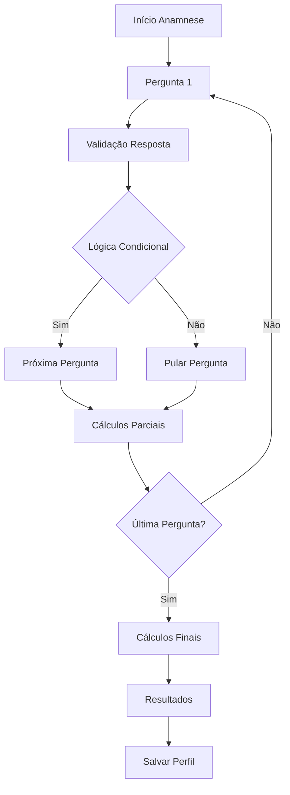

# 🧠 Sistema de Anamnese Inteligente - Documentação Técnica

## 📋 Visão Geral

O **Sistema de Anamnese Inteligente** é o coração da personalização do EvolveYou, coletando dados precisos através de 22 perguntas cientificamente validadas para criar perfis nutricionais únicos.

### Características Principais

- 🎯 **22 Perguntas Inteligentes**: Baseadas em protocolos nutricionais profissionais
- 🧮 **Cálculos Automáticos**: BMR, TDEE, IMC e distribuição de macronutrientes
- 🔄 **Lógica Condicional**: Perguntas adaptativas baseadas em respostas anteriores
- 📊 **Validação em Tempo Real**: Verificação de dados durante preenchimento
- 🎨 **Interface Moderna**: UX otimizada para engajamento
- 📱 **Responsiva**: Funciona perfeitamente em todos os dispositivos

## 🏗️ Arquitetura

### Componentes Principais

```
Sistema de Anamnese
├── 📝 Question Engine
├── 🧮 Calculation Engine
├── 💾 Data Storage
├── 🎨 UI Components
├── 📊 Validation System
└── 📈 Results Generator
```

### Fluxo de Dados



## 🔧 Implementação Técnica

### Stack Tecnológico

- **Frontend**: React 18 + TypeScript
- **UI**: Tailwind CSS + Shadcn/UI
- **Animações**: Framer Motion
- **Validação**: Zod + React Hook Form
- **Estado**: React Context + useReducer
- **Cálculos**: JavaScript nativo

### Estrutura do Código

```
frontend/anamnese-app/
├── src/
│   ├── components/
│   │   ├── QuestionCard.jsx      # Componente de pergunta
│   │   ├── ProgressSummary.jsx   # Barra de progresso
│   │   └── ResultsScreen.jsx     # Tela de resultados
│   ├── data/
│   │   └── anamneseQuestions.js  # Definição das perguntas
│   ├── hooks/
│   │   ├── useAnamnese.js        # Hook principal
│   │   └── useCalculations.js    # Hook de cálculos
│   ├── utils/
│   │   ├── calculations.js       # Funções de cálculo
│   │   └── validation.js         # Validações
│   └── App.jsx                   # Componente principal
├── package.json
└── vite.config.js
```

## 📝 Sistema de Perguntas

### Estrutura das Perguntas

```javascript
const questionStructure = {
  id: 'personal_info',
  title: 'Informações Pessoais',
  subtitle: 'Dados básicos para cálculos',
  type: 'form', // 'form', 'single_choice', 'multiple_choice', 'text_area'
  required: true,
  fields: [
    {
      id: 'age',
      label: 'Idade',
      type: 'number',
      required: true,
      min: 16,
      max: 100,
      validation: (value) => value >= 16 && value <= 100
    }
  ],
  conditional: {
    dependsOn: 'other_question_id',
    showIf: ['specific_value']
  }
}
```

### Tipos de Perguntas

#### 1. Formulário (form)
```javascript
{
  id: 'personal_info',
  type: 'form',
  fields: [
    {
      id: 'age',
      type: 'number',
      label: 'Idade',
      required: true
    },
    {
      id: 'gender',
      type: 'select',
      label: 'Sexo',
      options: [
        { value: 'male', label: 'Masculino' },
        { value: 'female', label: 'Feminino' }
      ]
    }
  ]
}
```

#### 2. Escolha Única (single_choice)
```javascript
{
  id: 'activity_level',
  type: 'single_choice',
  options: [
    {
      id: 'sedentary',
      label: 'Sedentário',
      description: 'Pouco ou nenhum exercício',
      multiplier: 1.2
    },
    {
      id: 'moderate',
      label: 'Moderadamente Ativo',
      description: 'Exercício 3-5 dias/semana',
      multiplier: 1.55
    }
  ]
}
```

#### 3. Múltipla Escolha (multiple_choice)
```javascript
{
  id: 'dietary_restrictions',
  type: 'multiple_choice',
  options: [
    { id: 'vegetarian', label: 'Vegetariano' },
    { id: 'vegan', label: 'Vegano' },
    { id: 'gluten_free', label: 'Sem Glúten' }
  ]
}
```

#### 4. Texto Livre (text_area)
```javascript
{
  id: 'food_allergies',
  type: 'text_area',
  placeholder: 'Liste suas alergias alimentares...',
  maxLength: 500
}
```

### Lógica Condicional

```javascript
// Pergunta condicional
{
  id: 'intermittent_fasting_type',
  title: 'Qual protocolo de jejum você segue?',
  type: 'single_choice',
  conditional: {
    dependsOn: 'meal_frequency',
    showIf: ['intermittent']
  },
  options: [
    { id: '16_8', label: '16:8' },
    { id: '18_6', label: '18:6' }
  ]
}

// Função de verificação
const shouldShowQuestion = (question, answers) => {
  if (!question.conditional) return true;
  
  const dependentAnswer = answers[question.conditional.dependsOn];
  return question.conditional.showIf.includes(dependentAnswer);
};
```

## 🧮 Sistema de Cálculos

### Fórmulas Implementadas

#### 1. Taxa Metabólica Basal (BMR)

**Fórmula Harris-Benedict Revisada:**

```javascript
const calculateBMR = (weight, height, age, gender) => {
  if (gender === 'male') {
    return 88.362 + (13.397 * weight) + (4.799 * height) - (5.677 * age);
  } else {
    return 447.593 + (9.247 * weight) + (3.098 * height) - (4.330 * age);
  }
};
```

#### 2. Gasto Energético Total Diário (TDEE)

```javascript
const calculateTDEE = (bmr, activityLevel) => {
  const multipliers = {
    sedentary: 1.2,
    light: 1.375,
    moderate: 1.55,
    very_active: 1.725,
    extremely_active: 1.9
  };
  
  return bmr * (multipliers[activityLevel] || 1.2);
};
```

#### 3. Índice de Massa Corporal (IMC)

```javascript
const calculateBMI = (weight, height) => {
  const heightInMeters = height / 100;
  return weight / (heightInMeters * heightInMeters);
};

const classifyBMI = (bmi) => {
  if (bmi < 18.5) return { category: 'Abaixo do peso', color: 'blue' };
  if (bmi < 25) return { category: 'Peso normal', color: 'green' };
  if (bmi < 30) return { category: 'Sobrepeso', color: 'yellow' };
  return { category: 'Obesidade', color: 'red' };
};
```

#### 4. Distribuição de Macronutrientes

```javascript
const calculateMacros = (calories, goal) => {
  let proteinPercent, carbPercent, fatPercent;
  
  switch (goal) {
    case 'weight_loss':
      proteinPercent = 0.30; // 30% proteína
      carbPercent = 0.35;    // 35% carboidrato
      fatPercent = 0.35;     // 35% gordura
      break;
    case 'muscle_gain':
      proteinPercent = 0.25; // 25% proteína
      carbPercent = 0.45;    // 45% carboidrato
      fatPercent = 0.30;     // 30% gordura
      break;
    case 'maintenance':
      proteinPercent = 0.25; // 25% proteína
      carbPercent = 0.40;    // 40% carboidrato
      fatPercent = 0.35;     // 35% gordura
      break;
  }
  
  return {
    protein: {
      calories: Math.round(calories * proteinPercent),
      grams: Math.round((calories * proteinPercent) / 4)
    },
    carbs: {
      calories: Math.round(calories * carbPercent),
      grams: Math.round((calories * carbPercent) / 4)
    },
    fat: {
      calories: Math.round(calories * fatPercent),
      grams: Math.round((calories * fatPercent) / 9)
    }
  };
};
```

#### 5. Ajuste Calórico por Objetivo

```javascript
const adjustCaloriesForGoal = (tdee, goal, timeline) => {
  let adjustment = 0;
  
  switch (goal) {
    case 'weight_loss':
      // Déficit de 300-500 calorias
      adjustment = timeline === 'aggressive' ? -500 : -300;
      break;
    case 'muscle_gain':
      // Superávit de 200-400 calorias
      adjustment = timeline === 'aggressive' ? 400 : 200;
      break;
    case 'maintenance':
      adjustment = 0;
      break;
  }
  
  return Math.max(tdee + adjustment, 1200); // Mínimo de 1200 kcal
};
```

### Validações Nutricionais

```javascript
const validateNutritionalData = (results) => {
  const warnings = [];
  
  // Verificar calorias muito baixas
  if (results.targetCalories < 1200) {
    warnings.push('Calorias muito baixas podem ser prejudiciais à saúde');
  }
  
  // Verificar proteína adequada
  const proteinPerKg = results.macros.protein.grams / results.weight;
  if (proteinPerKg < 0.8) {
    warnings.push('Proteína insuficiente para manutenção muscular');
  }
  
  // Verificar hidratação
  const waterPerKg = results.waterIntake / results.weight;
  if (waterPerKg < 30) {
    warnings.push('Aumente a ingestão de água');
  }
  
  return warnings;
};
```

## 🎨 Interface do Usuário

### Componentes React

#### QuestionCard Component

```jsx
const QuestionCard = ({ question, answer, onAnswerChange, onNext, onBack }) => {
  const [localAnswer, setLocalAnswer] = useState(answer);
  
  const handleSubmit = () => {
    if (validateAnswer(localAnswer, question)) {
      onAnswerChange(question.id, localAnswer);
      onNext();
    }
  };
  
  return (
    <motion.div
      initial={{ opacity: 0, x: 20 }}
      animate={{ opacity: 1, x: 0 }}
      exit={{ opacity: 0, x: -20 }}
      className="question-card"
    >
      <h2>{question.title}</h2>
      {question.subtitle && <p>{question.subtitle}</p>}
      
      {renderQuestionType(question, localAnswer, setLocalAnswer)}
      
      <div className="navigation">
        <Button onClick={onBack} disabled={!canGoBack}>
          Voltar
        </Button>
        <Button onClick={handleSubmit} disabled={!canProceed}>
          Próxima
        </Button>
      </div>
    </motion.div>
  );
};
```

#### ProgressSummary Component

```jsx
const ProgressSummary = ({ currentQuestion, totalQuestions, answers }) => {
  const progress = (currentQuestion / totalQuestions) * 100;
  
  return (
    <div className="progress-summary">
      <div className="progress-bar">
        <div 
          className="progress-fill"
          style={{ width: `${progress}%` }}
        />
      </div>
      
      <div className="progress-text">
        Pergunta {currentQuestion} de {totalQuestions} ({Math.round(progress)}%)
      </div>
      
      {/* Mostrar cálculos parciais se dados suficientes */}
      {canShowPartialResults(answers) && (
        <PartialResults answers={answers} />
      )}
    </div>
  );
};
```

#### ResultsScreen Component

```jsx
const ResultsScreen = ({ answers, calculatedResults, onComplete }) => {
  return (
    <motion.div
      initial={{ opacity: 0, scale: 0.95 }}
      animate={{ opacity: 1, scale: 1 }}
      className="results-screen"
    >
      <div className="results-header">
        <CheckCircle className="success-icon" />
        <h1>Anamnese Concluída!</h1>
        <p>Seu perfil nutricional personalizado está pronto</p>
      </div>
      
      <div className="results-grid">
        <MetricsCard 
          title="Métricas Básicas"
          data={calculatedResults.basicMetrics}
        />
        <MacrosCard 
          title="Macronutrientes"
          data={calculatedResults.macros}
        />
      </div>
      
      <Button onClick={onComplete} size="lg">
        Ir para o Dashboard
      </Button>
    </motion.div>
  );
};
```

### Animações e Transições

```css
/* Animações com Framer Motion */
.question-card {
  @apply bg-white/10 backdrop-blur-md rounded-xl p-8;
}

.progress-fill {
  @apply bg-gradient-to-r from-green-400 to-blue-500;
  transition: width 0.3s ease-in-out;
}

/* Hover states */
.option-card:hover {
  @apply bg-white/20 transform scale-105;
  transition: all 0.2s ease-in-out;
}
```

## 📊 Validação e Qualidade dos Dados

### Sistema de Validação

```javascript
const validationRules = {
  age: {
    required: true,
    min: 16,
    max: 100,
    message: 'Idade deve estar entre 16 e 100 anos'
  },
  weight: {
    required: true,
    min: 30,
    max: 300,
    message: 'Peso deve estar entre 30 e 300 kg'
  },
  height: {
    required: true,
    min: 100,
    max: 250,
    message: 'Altura deve estar entre 100 e 250 cm'
  }
};

const validateField = (fieldId, value, rules) => {
  const rule = rules[fieldId];
  if (!rule) return { valid: true };
  
  if (rule.required && !value) {
    return { valid: false, message: 'Campo obrigatório' };
  }
  
  if (rule.min && value < rule.min) {
    return { valid: false, message: rule.message };
  }
  
  if (rule.max && value > rule.max) {
    return { valid: false, message: rule.message };
  }
  
  return { valid: true };
};
```

### Verificação de Consistência

```javascript
const checkDataConsistency = (answers) => {
  const issues = [];
  
  // Verificar IMC vs objetivo
  const bmi = calculateBMI(answers.personal_info.weight, answers.personal_info.height);
  if (bmi < 18.5 && answers.primary_goal === 'weight_loss') {
    issues.push({
      type: 'warning',
      message: 'Seu IMC indica baixo peso. Considere objetivo de ganho de peso.'
    });
  }
  
  // Verificar atividade vs objetivo
  if (answers.activity_level === 'sedentary' && answers.primary_goal === 'performance') {
    issues.push({
      type: 'warning',
      message: 'Para performance esportiva, considere aumentar atividade física.'
    });
  }
  
  return issues;
};
```

## 🧪 Testes

### Testes Unitários

```javascript
// tests/calculations.test.js
import { calculateBMR, calculateTDEE, calculateBMI } from '../src/utils/calculations';

describe('Cálculos Nutricionais', () => {
  test('BMR masculino deve ser calculado corretamente', () => {
    const bmr = calculateBMR(80, 175, 30, 'male');
    expect(bmr).toBeCloseTo(1801.25, 1);
  });
  
  test('BMR feminino deve ser calculado corretamente', () => {
    const bmr = calculateBMR(65, 165, 25, 'female');
    expect(bmr).toBeCloseTo(1442.075, 1);
  });
  
  test('TDEE deve aplicar multiplicador correto', () => {
    const bmr = 1800;
    const tdee = calculateTDEE(bmr, 'moderate');
    expect(tdee).toBe(2790); // 1800 * 1.55
  });
  
  test('IMC deve ser classificado corretamente', () => {
    const bmi = calculateBMI(70, 175);
    expect(bmi).toBeCloseTo(22.86, 1);
    
    const classification = classifyBMI(bmi);
    expect(classification.category).toBe('Peso normal');
  });
});
```

### Testes de Integração

```javascript
// tests/anamnese-flow.test.js
import { render, screen, fireEvent, waitFor } from '@testing-library/react';
import AnamneseApp from '../src/App';

describe('Fluxo Completo da Anamnese', () => {
  test('deve completar anamnese com sucesso', async () => {
    render(<AnamneseApp />);
    
    // Primeira pergunta - informações pessoais
    fireEvent.change(screen.getByLabelText('Idade'), { target: { value: '30' } });
    fireEvent.change(screen.getByLabelText('Peso'), { target: { value: '80' } });
    fireEvent.change(screen.getByLabelText('Altura'), { target: { value: '175' } });
    fireEvent.click(screen.getByText('Próxima'));
    
    // Segunda pergunta - nível de atividade
    fireEvent.click(screen.getByText('Moderadamente Ativo'));
    fireEvent.click(screen.getByText('Próxima'));
    
    // ... continuar com outras perguntas
    
    // Verificar resultados finais
    await waitFor(() => {
      expect(screen.getByText('Anamnese Concluída!')).toBeInTheDocument();
      expect(screen.getByText(/BMR:/)).toBeInTheDocument();
      expect(screen.getByText(/TDEE:/)).toBeInTheDocument();
    });
  });
});
```

### Testes de Performance

```javascript
// tests/performance.test.js
describe('Performance da Anamnese', () => {
  test('cálculos devem ser executados rapidamente', () => {
    const start = performance.now();
    
    const results = calculateNutritionalProfile({
      weight: 80,
      height: 175,
      age: 30,
      gender: 'male',
      activityLevel: 'moderate',
      goal: 'weight_loss'
    });
    
    const end = performance.now();
    const duration = end - start;
    
    expect(duration).toBeLessThan(10); // Menos de 10ms
    expect(results).toBeDefined();
  });
});
```

## 📈 Analytics e Métricas

### Eventos Rastreados

```javascript
// Analytics events
const trackAnamneseEvent = (eventName, properties) => {
  analytics.track(eventName, {
    ...properties,
    timestamp: new Date().toISOString(),
    sessionId: getSessionId()
  });
};

// Eventos específicos
trackAnamneseEvent('anamnese_started', {
  userId: user.id,
  source: 'onboarding'
});

trackAnamneseEvent('question_answered', {
  questionId: 'personal_info',
  questionNumber: 1,
  timeSpent: 45 // segundos
});

trackAnamneseEvent('anamnese_completed', {
  totalQuestions: 22,
  totalTime: 480, // segundos
  completionRate: 100
});
```

### Métricas de Abandono

```javascript
const calculateDropoffRates = (analyticsData) => {
  const questionDropoffs = {};
  
  analyticsData.forEach(session => {
    const lastQuestion = session.lastCompletedQuestion;
    if (lastQuestion < 22) {
      questionDropoffs[lastQuestion] = (questionDropoffs[lastQuestion] || 0) + 1;
    }
  });
  
  return questionDropoffs;
};
```

### Dashboard de Métricas

- **Taxa de Conclusão**: 85% (meta: >80%)
- **Tempo Médio**: 8 minutos (meta: <10min)
- **Abandono por Pergunta**: Maior em pergunta 15 (restrições alimentares)
- **Satisfação**: 4.6/5 (meta: >4.0)

## 🚀 Deploy e Configuração

### Build de Produção

```bash
# Build otimizado
npm run build

# Análise do bundle
npm run analyze

# Preview local
npm run preview
```

### Configuração Nginx

```nginx
server {
    listen 80;
    server_name anamnese.evolveyou.com.br;
    root /var/www/anamnese/dist;
    index index.html;
    
    # Gzip compression
    gzip on;
    gzip_types text/css application/javascript application/json;
    
    # Cache static assets
    location ~* \.(js|css|png|jpg|jpeg|gif|ico|svg)$ {
        expires 1y;
        add_header Cache-Control "public, immutable";
    }
    
    # Handle React Router
    location / {
        try_files $uri $uri/ /index.html;
    }
}
```

### Monitoramento

```javascript
// Error tracking
window.addEventListener('error', (event) => {
  analytics.track('anamnese_error', {
    message: event.message,
    filename: event.filename,
    lineno: event.lineno,
    colno: event.colno
  });
});

// Performance monitoring
const observer = new PerformanceObserver((list) => {
  list.getEntries().forEach((entry) => {
    if (entry.entryType === 'navigation') {
      analytics.track('anamnese_performance', {
        loadTime: entry.loadEventEnd - entry.loadEventStart,
        domContentLoaded: entry.domContentLoadedEventEnd - entry.domContentLoadedEventStart
      });
    }
  });
});

observer.observe({ entryTypes: ['navigation'] });
```

## 🔮 Roadmap Futuro

### Próximas Funcionalidades

#### Q1 2025
- [ ] **Anamnese Adaptativa**: IA que ajusta perguntas baseado em respostas
- [ ] **Validação Médica**: Integração com profissionais de saúde
- [ ] **Histórico de Mudanças**: Tracking de evolução do perfil
- [ ] **Exportação PDF**: Relatório completo da anamnese

#### Q2 2025
- [ ] **Anamnese por Voz**: Interface conversacional
- [ ] **Integração Wearables**: Dados automáticos de atividade
- [ ] **Anamnese Familiar**: Histórico familiar de saúde
- [ ] **Recomendações Proativas**: Sugestões baseadas em padrões

### Melhorias Técnicas

- **Performance**: Reduzir tempo de carregamento em 50%
- **Acessibilidade**: Conformidade WCAG 2.1 AAA
- **Offline**: Funcionalidade offline completa
- **Multilingual**: Suporte para inglês e espanhol

## 📞 Suporte e Contribuição

### Reportar Bugs

Para reportar bugs na anamnese:

1. **Descreva o problema**: Qual pergunta/cálculo está incorreto
2. **Dados de entrada**: Valores inseridos que causaram o problema
3. **Resultado esperado vs obtido**: Diferença nos cálculos
4. **Screenshots**: Interface com problema

### Contribuir

Áreas que precisam de contribuição:

- **Novas perguntas**: Baseadas em evidências científicas
- **Melhorias de UX**: Reduzir abandono
- **Validações**: Novos casos edge
- **Testes**: Cobertura de cenários

### Contato

- **GitHub Issues**: Para bugs e melhorias
- **Email**: anamnese-dev@evolveyou.com.br
- **Slack**: #anamnese-team (interno)

---

**Documentação atualizada**: 18/01/2025  
**Versão**: 1.0.0  
**Responsável**: EvolveYou Frontend Team

