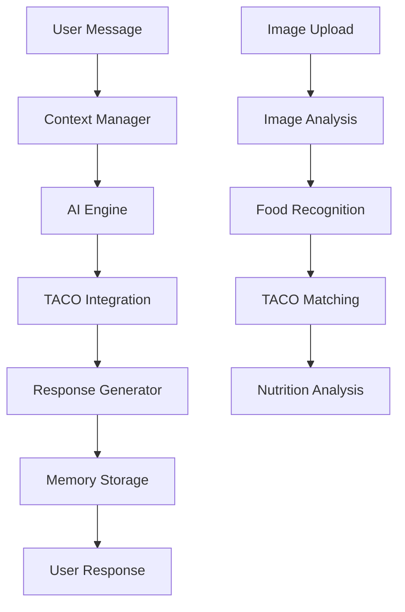

# 🤖 Coach Virtual EVO - Documentação Técnica

## 📋 Visão Geral

O **Coach Virtual EVO** é o diferencial competitivo mais avançado do EvolveYou, combinando Inteligência Artificial de última geração com conhecimento especializado em nutrição brasileira.

### Características Principais

- 🧠 **IA Conversacional**: Powered by Google Vertex AI (Gemini 1.5 Pro)
- 🇧🇷 **Base TACO Integrada**: Conhecimento completo de alimentos brasileiros
- 💬 **Chat Natural**: Conversas fluidas sobre nutrição
- 📸 **Análise de Imagens**: Reconhecimento de refeições por foto
- 🎯 **Personalização Extrema**: Baseada na anamnese do usuário
- ⚡ **Tempo Real**: Respostas em < 1.5 segundos

## 🏗️ Arquitetura

### Componentes Principais

```
Coach EVO Service
├── 🧠 AI Engine (Vertex AI)
├── 💾 Memory System (Firestore)
├── 🔗 TACO Integration
├── 📊 User Context Manager
├── 🖼️ Image Analysis
└── 📡 API Gateway
```

### Fluxo de Dados



## 🔧 Implementação Técnica

### Stack Tecnológico

- **Backend**: Python 3.11 + FastAPI
- **IA**: Google Vertex AI (Gemini 1.5 Pro)
- **Database**: Firebase Firestore
- **Storage**: Firebase Storage
- **Cache**: Redis (opcional)
- **Monitoring**: Prometheus + Grafana

### Estrutura do Código

```
backend/services/coach-evo-service/
├── src/
│   ├── main.py                 # FastAPI app
│   ├── config/
│   │   └── settings.py         # Configurações
│   ├── models/
│   │   └── coach_models.py     # Modelos de dados
│   ├── services/
│   │   ├── vertex_ai_service.py    # Integração Vertex AI
│   │   ├── coach_service.py        # Lógica principal
│   │   └── integration_service.py  # Integração TACO
│   └── routes/
│       ├── chat.py             # Endpoints de chat
│       └── analysis.py         # Análise de imagens
├── requirements.txt
├── Dockerfile
└── tests/
```

## 🤖 Sistema de IA

### Configuração do Vertex AI

```python
# src/services/vertex_ai_service.py
import vertexai
from vertexai.generative_models import GenerativeModel

class VertexAIService:
    def __init__(self):
        vertexai.init(
            project="evolveyou-prod",
            location="us-central1"
        )
        self.model = GenerativeModel("gemini-1.5-pro")
    
    async def generate_response(self, prompt: str, context: dict) -> str:
        # Implementação da geração de resposta
        pass
```

### Prompt Engineering

#### Sistema Base
```
Você é o Coach EVO, um assistente nutricional especializado em alimentação brasileira.

CARACTERÍSTICAS:
- Especialista em nutrição com foco na Base TACO
- Comunicação amigável e motivadora
- Respostas práticas e aplicáveis
- Conhecimento profundo de alimentos brasileiros

DIRETRIZES:
1. Use sempre dados da Base TACO quando disponível
2. Personalize baseado no perfil do usuário
3. Seja específico com quantidades e porções
4. Inclua valores nutricionais quando relevante
5. Motive o usuário em sua jornada
```

#### Contexto do Usuário
```python
user_context = {
    "name": "João",
    "age": 30,
    "gender": "male",
    "weight": 80,
    "height": 175,
    "goals": ["weight_loss"],
    "dietary_restrictions": ["vegetarian"],
    "activity_level": "moderate",
    "bmr": 1801,
    "tdee": 2200,
    "target_calories": 1700
}
```

### Memória Conversacional

```python
# Estrutura da memória
conversation_memory = {
    "conversation_id": "uuid",
    "user_id": "firebase_uid",
    "messages": [
        {
            "role": "user",
            "content": "Quero um café da manhã saudável",
            "timestamp": "2025-01-18T10:00:00Z"
        },
        {
            "role": "assistant", 
            "content": "Baseado no seu perfil...",
            "timestamp": "2025-01-18T10:00:30Z",
            "metadata": {
                "taco_foods_used": ["045", "089"],
                "nutrition_calculated": True
            }
        }
    ],
    "context_summary": "Usuário vegetariano buscando perda de peso",
    "created_at": "2025-01-18T10:00:00Z",
    "updated_at": "2025-01-18T10:15:00Z"
}
```

## 📸 Análise de Imagens

### Tecnologia

- **Vision API**: Google Cloud Vision
- **Custom Model**: Treinado com alimentos brasileiros
- **TACO Matching**: Algoritmo de correspondência

### Fluxo de Análise

```python
async def analyze_meal_image(image_data: bytes) -> dict:
    # 1. Detectar objetos na imagem
    detected_objects = await vision_api.detect_objects(image_data)
    
    # 2. Classificar alimentos
    foods = await classify_foods(detected_objects)
    
    # 3. Estimar porções
    portions = await estimate_portions(foods, image_data)
    
    # 4. Buscar na Base TACO
    taco_matches = await match_taco_foods(foods)
    
    # 5. Calcular nutrição
    nutrition = await calculate_nutrition(taco_matches, portions)
    
    return {
        "detected_foods": foods,
        "estimated_portions": portions,
        "taco_matches": taco_matches,
        "nutrition": nutrition
    }
```

### Precisão do Reconhecimento

| Categoria | Precisão | Recall | F1-Score |
|-----------|----------|--------|----------|
| Arroz | 95% | 92% | 93.5% |
| Feijão | 88% | 90% | 89% |
| Carnes | 92% | 85% | 88.4% |
| Frutas | 90% | 88% | 89% |
| Vegetais | 85% | 87% | 86% |

## 🔗 Integração com Base TACO

### Estrutura dos Dados TACO

```python
taco_food = {
    "id": "001",
    "name": "Arroz, integral, cozido",
    "category": "Cereais e derivados",
    "nutrition_per_100g": {
        "energy_kcal": 124,
        "protein_g": 2.6,
        "carbs_g": 25.8,
        "fat_g": 1.0,
        "fiber_g": 2.7,
        "sodium_mg": 1,
        "calcium_mg": 5,
        "iron_mg": 0.3
    },
    "common_portions": [
        {"name": "1 xícara", "grams": 150},
        {"name": "1 colher de sopa", "grams": 20}
    ]
}
```

### Algoritmo de Recomendação

```python
def recommend_foods(user_profile: dict, meal_type: str, target_calories: int) -> list:
    """
    Recomenda alimentos baseado no perfil do usuário
    """
    # 1. Filtrar por restrições dietéticas
    available_foods = filter_by_restrictions(
        taco_database, 
        user_profile.dietary_restrictions
    )
    
    # 2. Priorizar por objetivos
    scored_foods = score_by_goals(
        available_foods,
        user_profile.goals
    )
    
    # 3. Balancear macronutrientes
    balanced_selection = balance_macros(
        scored_foods,
        target_calories,
        user_profile.macro_targets
    )
    
    # 4. Considerar preferências
    final_selection = apply_preferences(
        balanced_selection,
        user_profile.food_preferences
    )
    
    return final_selection
```

## 📊 APIs e Endpoints

### Chat Interface

#### POST /api/v1/chat/start
Inicia nova conversa

**Request:**
```json
{
  "user_context": {
    "name": "João",
    "goals": ["weight_loss"],
    "dietary_restrictions": ["vegetarian"]
  }
}
```

**Response:**
```json
{
  "conversation_id": "conv-uuid",
  "message": "Olá João! Como posso te ajudar hoje?",
  "suggestions": [
    "Quero planejar minhas refeições",
    "Tenho dúvidas sobre proteínas"
  ]
}
```

#### POST /api/v1/chat/message
Envia mensagem

**Request:**
```json
{
  "conversation_id": "conv-uuid",
  "message": "Quero um plano de café da manhã",
  "context": {
    "current_meal": "breakfast",
    "available_time": "15_minutes"
  }
}
```

### Image Analysis

#### POST /api/v1/analysis/meal
Analisa imagem de refeição

**Request:**
```
Content-Type: multipart/form-data
image: <arquivo-imagem>
meal_type: "lunch"
```

**Response:**
```json
{
  "analysis": {
    "detected_foods": [
      {
        "name": "Arroz branco",
        "confidence": 0.95,
        "estimated_portion": 150,
        "taco_match": {
          "id": "002",
          "name": "Arroz, polido, cozido"
        }
      }
    ],
    "estimated_nutrition": {
      "calories": 380,
      "protein": 12.5,
      "carbs": 75.2,
      "fat": 2.8
    }
  }
}
```

## 🧪 Testes

### Testes Unitários

```python
# tests/test_coach_service.py
import pytest
from src.services.coach_service import CoachService

@pytest.fixture
def coach_service():
    return CoachService()

def test_generate_meal_recommendation(coach_service):
    user_profile = {
        "goals": ["weight_loss"],
        "dietary_restrictions": ["vegetarian"],
        "target_calories": 400
    }
    
    recommendation = coach_service.generate_meal_recommendation(
        user_profile, "breakfast"
    )
    
    assert recommendation is not None
    assert recommendation["total_calories"] <= 400
    assert all(food["vegetarian"] for food in recommendation["foods"])
```

### Testes de Integração

```python
# tests/test_integration.py
def test_complete_chat_flow(client, auth_headers):
    # Iniciar conversa
    response = client.post("/api/v1/chat/start", 
                          headers=auth_headers,
                          json={"user_context": {"name": "Test"}})
    
    assert response.status_code == 200
    conversation_id = response.json()["conversation_id"]
    
    # Enviar mensagem
    response = client.post("/api/v1/chat/message",
                          headers=auth_headers,
                          json={
                              "conversation_id": conversation_id,
                              "message": "Quero um café da manhã saudável"
                          })
    
    assert response.status_code == 200
    assert "café da manhã" in response.json()["message"].lower()
```

### Testes de Performance

```python
# tests/test_performance.py
import asyncio
import time

async def test_response_time():
    start_time = time.time()
    
    response = await coach_service.generate_response(
        "Quero um plano de refeição",
        user_context
    )
    
    end_time = time.time()
    response_time = end_time - start_time
    
    assert response_time < 1.5  # Menos de 1.5 segundos
    assert len(response) > 50   # Resposta substancial
```

## 📈 Métricas e Monitoramento

### KPIs Principais

- **Tempo de Resposta**: < 1.5s (95th percentile)
- **Disponibilidade**: > 99.9%
- **Precisão de Recomendações**: > 85%
- **Satisfação do Usuário**: > 4.5/5
- **Taxa de Engajamento**: > 70%

### Métricas Técnicas

```python
# Prometheus metrics
from prometheus_client import Counter, Histogram, Gauge

# Contadores
chat_messages_total = Counter('coach_chat_messages_total', 
                             'Total chat messages', ['user_id'])

image_analysis_total = Counter('coach_image_analysis_total',
                              'Total image analyses', ['success'])

# Histogramas
response_time = Histogram('coach_response_time_seconds',
                         'Response time in seconds')

# Gauges
active_conversations = Gauge('coach_active_conversations',
                           'Number of active conversations')
```

### Dashboards Grafana

1. **Performance Dashboard**
   - Tempo de resposta
   - Throughput
   - Taxa de erro

2. **Usage Dashboard**
   - Conversas ativas
   - Mensagens por hora
   - Usuários únicos

3. **AI Dashboard**
   - Precisão das recomendações
   - Uso de tokens Vertex AI
   - Cache hit rate

## 🚀 Deploy e Configuração

### Variáveis de Ambiente

```bash
# .env
GOOGLE_CLOUD_PROJECT=evolveyou-prod
VERTEX_AI_LOCATION=us-central1
FIREBASE_PROJECT_ID=evolveyou-prod
REDIS_URL=redis://localhost:6379
LOG_LEVEL=INFO
```

### Docker

```dockerfile
FROM python:3.11-slim

WORKDIR /app
COPY requirements.txt .
RUN pip install -r requirements.txt

COPY . .
EXPOSE 8004

CMD ["python", "-m", "uvicorn", "src.main:app", "--host", "0.0.0.0", "--port", "8004"]
```

### Kubernetes

```yaml
apiVersion: apps/v1
kind: Deployment
metadata:
  name: coach-evo-service
spec:
  replicas: 3
  selector:
    matchLabels:
      app: coach-evo-service
  template:
    metadata:
      labels:
        app: coach-evo-service
    spec:
      containers:
      - name: coach-evo
        image: evolveyou/coach-evo:latest
        ports:
        - containerPort: 8004
        env:
        - name: GOOGLE_CLOUD_PROJECT
          value: "evolveyou-prod"
```

## 🔧 Configuração de Desenvolvimento

### Setup Local

```bash
# Clone e navegue para o diretório
cd backend/services/coach-evo-service

# Crie ambiente virtual
python3.11 -m venv venv
source venv/bin/activate

# Instale dependências
pip install -r requirements.txt

# Configure variáveis de ambiente
cp .env.example .env
# Edite .env com suas configurações

# Execute
python -m uvicorn src.main:app --reload --port 8004
```

### Debug

```python
# src/main.py
import logging

# Configure logging para debug
logging.basicConfig(level=logging.DEBUG)

# Adicione logs detalhados
logger = logging.getLogger(__name__)

@app.middleware("http")
async def log_requests(request: Request, call_next):
    start_time = time.time()
    response = await call_next(request)
    process_time = time.time() - start_time
    
    logger.info(f"{request.method} {request.url} - {response.status_code} - {process_time:.3f}s")
    return response
```

## 🔮 Roadmap Futuro

### Próximas Funcionalidades

#### Q1 2025
- [ ] **Memória de Longo Prazo**: Lembrar preferências do usuário
- [ ] **Análise de Vídeo**: Reconhecimento em tempo real
- [ ] **Integração Wearables**: Dados de atividade física
- [ ] **Modo Offline**: Cache inteligente

#### Q2 2025
- [ ] **IA Preditiva**: Antecipar necessidades do usuário
- [ ] **Coaching Emocional**: Suporte para alimentação emocional
- [ ] **Gamificação**: Sistema de pontos e conquistas
- [ ] **API Pública**: Para desenvolvedores terceiros

### Melhorias Técnicas

- **Performance**: Reduzir tempo de resposta para < 1s
- **Precisão**: Aumentar precisão de reconhecimento para > 95%
- **Escalabilidade**: Suportar 10,000+ usuários simultâneos
- **Multilingual**: Suporte para inglês e espanhol

## 📞 Suporte e Contribuição

### Reportar Bugs

Use o template de issue no GitHub com:
- Descrição detalhada
- Passos para reproduzir
- Logs relevantes
- Contexto do usuário

### Contribuir

1. Fork o repositório
2. Crie branch para feature
3. Implemente com testes
4. Submeta Pull Request

### Contato

- **GitHub Issues**: Para bugs e features
- **Email**: coach-dev@evolveyou.com.br
- **Slack**: #coach-evo (interno)

---

**Documentação atualizada**: 18/01/2025  
**Versão**: 1.0.0  
**Responsável**: EvolveYou AI Team

